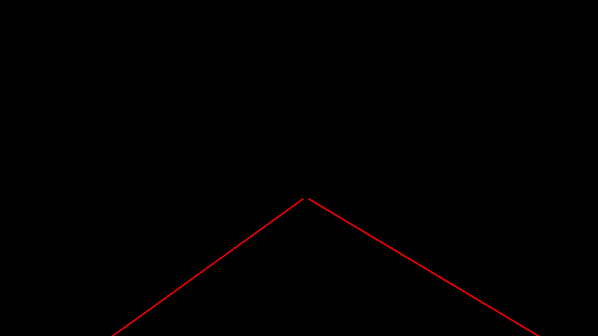

# **Finding Lane Lines on the Road** 

---

**Finding Lane Lines on the Road**

The goals / steps of this project are the following:
* Make a pipeline that finds lane lines on the road
* Reflect on your work in a written report

---

### Reflection

### 1. The processing pipeline

My pipeline consisted of 6 steps. First, I converted the images to grayscale, shown as below.
 

The second step is to define a kernel size for the Gaussian smoothing and apply which to the grayscale image.

The Third step is to use canny method to find out edges.

The fouth step, a mask is applied to keep the edges of our interesting region.

The fifth step is drawing the lane lines with Hough transforming method.

In order to draw a single line on the left and right lanes, I modified the draw_lines() function.
I calculate the slope of each line which Hough transforming method returns, and then I divide them into two groups.
If the slope of a line is positive, this line might be belong to the right lane line group. In the opposite,
if a line's slope is negative, this line might be belong to the left one.
After grouping, I could obtain the average slope of both groups.
Meanwhile, I also keep a point for each lane line groups. 
For the right lane, the point would be the larger y position end of a line and its x position is the smallest in the group.
For the left lane, the point would also be the larger y position end of a line bit its x position is the largest in the group.
With the slope and from the point, I can draw the right or left lane line extended to the bottom of the image and 
the far end of the lane.
But such a way is not robust when the pipeline works on the videos. 
Some unwanted lane line mark will lead to unexpected line slope and end points. Therefore I apply some thresholds to filter
out those lines that have too large or too small slope.

The last step is mixing the lane lines with the original image.

### 2. The potential shortcomings with my current pipeline

One potential shortcoming would be what would happen when the color of the road surface becomes lighter, 
such as concrete road surfaces. The bugs could be observed at the 4" position of the challenge.mp4.
The lighter color of the road surface causes the left lane line undetected.

Another shortcoming could be the unwanted lines which has the slope close to the slope value belong to the true lane lines.
The bug could also be found around the same position of the challenge.mp4. The juncture of different road surfaces forms a line
which happens to have the slope value that could pass my simple filter and misleads us about the average slope of the left lane line.

### 3. The possible improvements to my pipeline

A possible improvement would be to tune the parameters for canny and Hough transforming methods according to the road surface dynamically.
There could be the optimal set of parameters specifically for each kind of road surface. The pipeline could first detect the color of road
surface and then decide to apply a suitable set of parameters to the methods.

Another potential improvement could be to modify the simple filter. 
